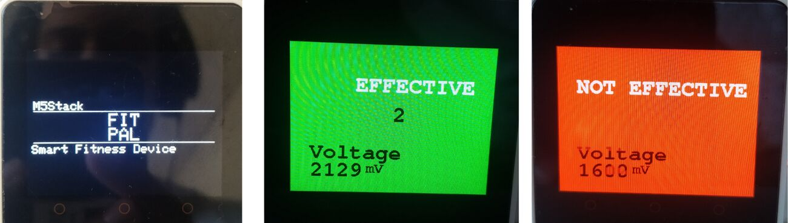

# FitPal: Repetition-Level Muscle-Activation Feedback

Surface-EMG biofeedback on an M5Stack Core2. FitPal tells a lifter, repetition by repetition, whether the target muscle was actually worked. Juan Fernando Castaño, Diab Singer and Román Villarreal.



## How it works

A Grove EMG sensor (VOUT to G35, 5 V, GND) feeds the Core2's ADC. The device shows an "effective" or "not effective" screen after every repetition, vibrates, and streams results to an Arduino IoT Cloud dashboard.

```
ADC (mV) → 50 Hz notch → 20 Hz high-pass → 350 Hz low-pass → 100 ms RMS → %MVC → repetition detector → effective?
```

- **Sampling.** A 1 kHz FreeRTOS task on core 0, four reads averaged per sample in millivolts. The display and cloud connection run on core 1.
- **Calibration.** Three seconds at rest, then three seconds of maximal contraction. The result is accepted only if the contraction clearly exceeds rest, so a loose electrode fails visibly. Activation is expressed as a fraction of the user's own maximum (%MVC).
- **Detector.** Hysteresis thresholds at 30 % and 15 % MVC, a 200 ms minimum duration, a 300 ms refractory period and an 8 s upper limit. A repetition counts as effective when its peak reaches 0.60 of MVC for curls and 0.54 for squats. These are parameters, not physiological claims.
- **Cloud.** Activation at 2 Hz, counters on change.

The whole signal chain is one header, `firmware/fitpal_core2/emg_dsp.h`, with no dynamic allocation and no Arduino dependency. The file that runs on the device is the file that is tested on a PC.

## Verification

- **Parity.** The C++ chain and an independent Python implementation agree on the envelope to 0.0076 mV and return the same ten repetitions with the same flags (`tests/`, `analysis/`).
- **Simulation.** Sixty synthetic sessions with mains hum at 20–100 % of the signal, a 1.65 V offset, baseline wander, ADC noise, 80 ms motion spikes up to 700 mV and a ±35 % spread in subject gain. The chain scores precision 0.99, recall 1.00 and F1 0.995. A fixed-threshold detector scores 0.69, 0.47 and 0.56.

The signal model is our own, so these scores describe the algorithm, not people. No recordings from the physical sensor have been scored yet. The sketch compiles for the M5Stack Core2 (ESP32 Arduino core 2.0.17, M5Core2 library 0.2.0) without the cloud option. The cloud variant has not been compiled and the firmware has not been run on the board. If your Grove module outputs an envelope instead of raw EMG, disable the notch and high-pass in `config.h`.

## Run the PC tests

```bash
# needs numpy, scipy, matplotlib and g++
python3 analysis/simulate_and_evaluate.py
```

The script builds the C++ test, runs both implementations and writes the figures and `summary.json`.

## Firmware setup

Copy `firmware/fitpal_core2/secrets.h.example` to `secrets.h` and fill in your Wi-Fi and Arduino IoT Cloud credentials. `secrets.h` is git-ignored.

## Contents

```
firmware/fitpal_core2/    sketch, emg_dsp.h, config.h, thingProperties.h, secrets.h.example
tests/                    PC harness and board stub (used for the host-side syntax check)
analysis/                 simulation and evaluation
report/                   technical report (PDF and LaTeX source)
images/                   device, dashboard and simulation figures
```

Rebuild the report: `cd report && pdflatex fitpal_report && bibtex fitpal_report && pdflatex fitpal_report && pdflatex fitpal_report`.
