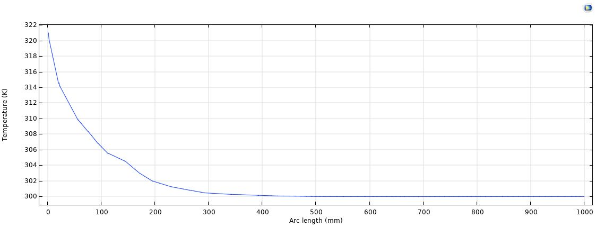

# Concentric Heat Exchanger Modelling in COMSOL

Conjugate heat-transfer models of a tube-in-tube water heat exchanger, with a systematic mesh-independence study and a comparison against bench-top data. Thermal Systems final project, NYU Abu Dhabi. Authors: Orsi Nagy and Juan Fernando Castaño.



## Contribution

- **Two scales, two dimensionalities.** An isothermal MEMS-scale block (four hot/cold temperature pairs, eight mesh densities) and a 1 m concentric exchanger in 3D and 2D axial section.
- **Mesh-independence study.** 4 predefined tetrahedral meshes in 3D and 5 meshes of different structure in 2D, each over three inlet-temperature cases.
- **Verification** of the selected mesh against measured hot-channel inlet/outlet temperatures (313.5 K in, 311.5 K out).

## Findings

- 3D: Fine and Extra fine coincide in all three cases; Extra coarse and Normal over-predict outlet temperature.
- 2D: Mesh 2 (extremely coarse free triangular, 47 210 elements) agrees with Mesh 1 (86 520), so it is about **2× cheaper** for the same result and was used for the remaining cases.
- The mapped rectangular mesh, though largest (108 000 elements), gave an implausible near-flat hot-channel profile: element count is not a quality measure.

## Model

Length 1 m; hot channel radius 1.25 cm, cold annulus radius 2.5 cm; ~1 mm copper wall; plug (uniform) velocity in both channels; outer surface insulated (Q = 0).

## What the study does not establish

- The experimental comparison is on the hot-channel outlet only and is **qualitative**; no residual is reported.
- Case temperatures and the 2D exit temperatures in the report were read from COMSOL plots, not exported tables.
- A solver discrepancy on the 3D Normal mesh (results depended on whether meshes were solved singly or together) was not resolved. The conclusions use meshes that are not affected by it.
- Not included: laminar-profile flow, counter-current runs, effectiveness–NTU cross-check (left as next steps).

## Contents

```
report/                            technical report (PDF and LaTeX source)
images/                            selected figures
```

Rebuild the report: `cd report && pdflatex heat_exchanger_report && bibtex heat_exchanger_report && pdflatex heat_exchanger_report && pdflatex heat_exchanger_report`.
