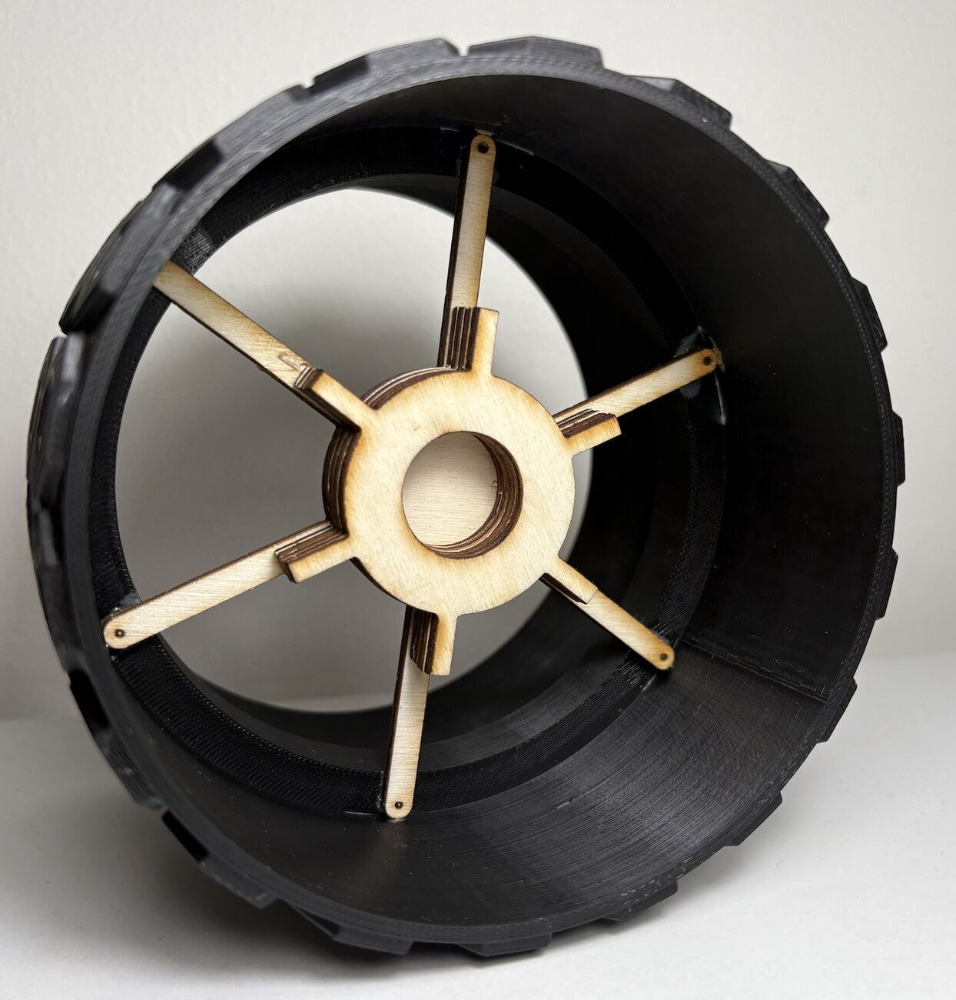

# Matamata Rover Wheel

A biomimetic planetary-rover wheel concept with a **25 % scale prototype**, built for NYU Abu Dhabi course ENGR-UH 2113 (Spring 2025) by Juan Fernando Castaño.



## Contribution

- **Hexagonal tread.** Replaces the wave-like tread of current Mars-rover wheels with hexagonal scutes (4 cm/side full scale), modelled on the matamata turtle shell, to spread contact stress and avoid corner damage.
- **Ribbed core, straight bars.** Perseverance-style core with added ribs; curved connector bars replaced by thicker straight bars.
- **Made at small scale.** Three print iterations, a laser-cut stacked core and a one-piece bar frame.

## Manufacturing log

| Part | Problem | Change |
|---|---|---|
| Tread | 90° hexagon edges would not print | 45° chamfer on the lower side of each hexagon |
| Inner rim | Second print failed on overhangs | 45° chamfer on the inner rim; third print succeeded |
| Core | One-piece core wasted material | Laser-cut stacked layers; test cylinders to calibrate spacing |
| Bars | Six loose bars broke when laser-cut at 25 % | Six bars joined to one circular frame |
| Fastening | Screws infeasible at 25 % scale | Glued for the prototype; screws/welds kept for full scale |

Prototype cost: **$64.50** (material, processing, labour, facility; breakdown in the course report).

## Proposed full-scale materials (not tested)

7075-T6 aluminium with Nitinol coating (tread), Nitinol-reinforced aluminium (core), Ti-6Al-4V (bars), 316 stainless (pins).

## Status and limits

- No mechanical testing (traction, fatigue, load) was done; the claims of even stress distribution and self-cleaning bevels are design intent, not measurements.
- The course report states a 25 % material-waste reduction from the laser-cut core; we did not measure it again.

## Layout

```
abstract.txt   report/   cad/   images/   docs/
```

`report/` holds the technical report (PDF and LaTeX source). `cad/` holds the SolidWorks parts and assembly and the STL files used for laser cutting. `images/` has the CAD renders and photographs of the prototype.
