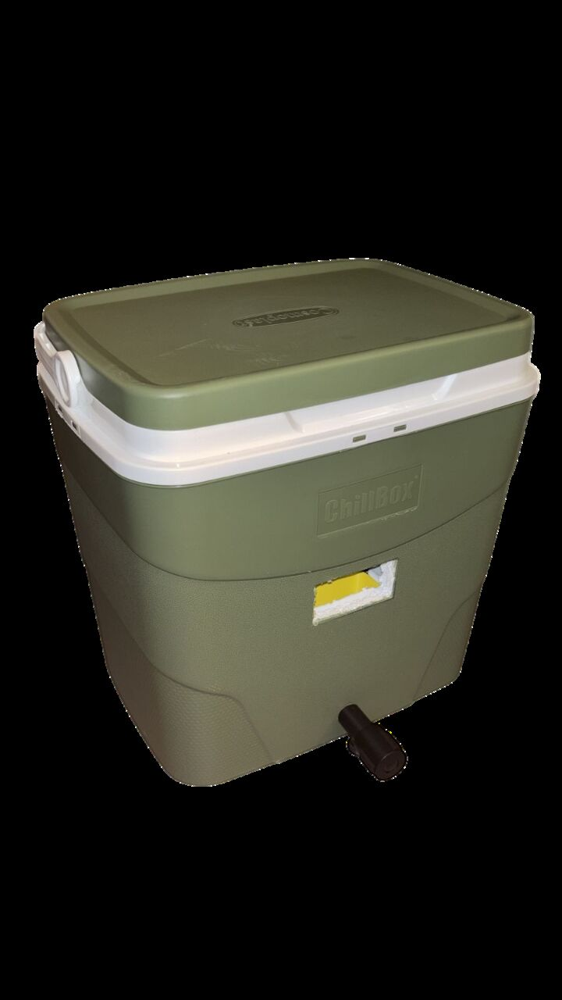

# Multi-Stage Thermoelectric Refrigerator

Compressor-less cooler built from Peltier modules, an Arduino PID loop, 3D-printed thermal hardware and PWM power electronics. ENGR-UH 3110 Instrumentation, Sensors & Actuators, NYU Abu Dhabi, Spring 2025. Juan Fernando Castaño with the Falcons team (7 students).



## Contribution and development

| Area | What we did |
|---|---|
| **PID control** | PID_v1 loop on an Arduino UNO, DS18B20 sensor, rotary-encoder setpoint (2–12 °C). Step-response study of three gain orderings; final Kp 100, Ki 0.1, Kd 1000. |
| **3D printing / thermal materials** | Three generations of TEC platform (closed box rejected; final: one plate, one fan per TEC); PLA kept off heat-bearing paths (softens ~60 °C); cork frames; PU-foam sealing; condensate funnel with drain valve; FEA of the platform support; laser-cut acrylic enclosures. |
| **Signal and power wiring** | Diagnosed IRF520 gate-drive limit (~10 V needed, Arduino gives ~5 V) and wire-gauge failure; went from 4 to 2 TECs, two MOSFETs per TEC with heatsinks, MOSFETs isolated in their own box away from the 1-wire/I²C signals, fans on a separate supply. |

## Result

Chamber **24.0 → 18.0 °C**, stable, in about 72 min (fan-mixed zone); about 4 °C at a local minimum next to the cold plate. MOSFETs settled at 34–40 °C. The sub-10 °C target was **not reached**; pumping capacity falls as the hot side warms.

## Limits and open points

- The cooling curve in the report is reconstructed from logged times per 1 °C step, not raw data.
- **No quantitative 3D-print material study exists**; material choices came from datasheet limits and build experience.
- Code review finding: the original sketch passed the setpoint as the PID library's input and the temperature as its setpoint (with `DIRECT`). It worked as a reverse-acting loop, but the derivative term then acts on the setpoint. The explanation we gave at the time for the erratic regime should be re-tested with the conventional form.
- `firmware/tec_pid/tec_pid.ino` is a reference sketch with the conventional `REVERSE` form, reconstructed from the documented configuration. It has not been run on the original hardware. OLED and encoder are replaced by a serial setpoint command.
- Recommended fix, not yet built: a logic-level MOSFET (IRLZ44N / STP55NF06L) or gate driver instead of the IRF520 modules.

## Contents

```
report/                            technical report (PDF and LaTeX source)
firmware/tec_pid/tec_pid.ino       reference control sketch
images/                            selected figures
```
