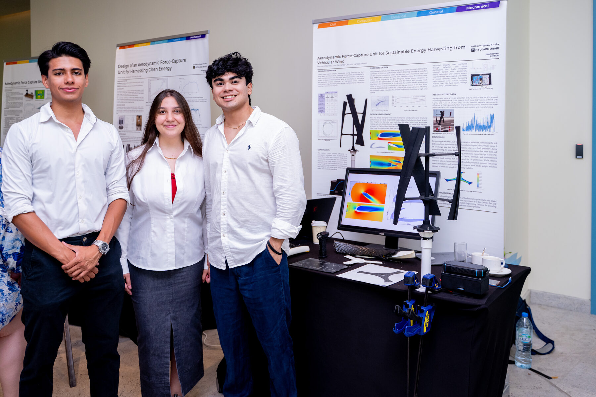

# Harvesting Energy from Traffic-Induced Wind

A compact vertical-axis wind turbine (VAWT) for roadside use in Abu Dhabi, an **all-composite carbon-fibre rotor**, and the logging system used to measure it. NYU Abu Dhabi engineering capstone, May 2025. Román I. Villarreal, Juan Fernando Castaño, Larissa Al Kseiri; supervisors P. George, J. Teo, J. I. Ryu.

> **Disclosure notice.** Parts of this work are subject to intellectual-property and patent filing. This repository describes what was built, how, and what it achieved. It deliberately omits aerodynamic profile definitions, blade and rotor dimensions, helical parameters, laminate schedules and simulation tables.



## Contribution

1. **Aerodynamic and load model.** 2D/3D CFD (ANSYS) and a per-revolution torque and centrifugal-load model for a three-blade rotor, used to estimate power and voltage at 2.25, 12 and 24 m/s for full-scale and prototype-scale rotors.
2. **Two prototype configurations** (lift-based baseline and hybrid) so the CFD hypothesis on multi-directional wind could be tested.
3. **Carbon-fibre rotor** (the main development), made entirely by hand layup:
   - blades laid up in single-piece PLA-printed moulds;
   - a tube wrapped on a mandrel with Teflon and Mylar release layers and cured at ambient temperature;
   - a hub plate cut from a flat laminate.
   The ply count came from flexural bending tests of laminate coupons (hand-laid carbon at about 475–600 MPa, against 215–395 MPa for the glass and chopped-strand laminates tested alongside) and a SolidWorks static study of the hub, whose peak von Mises stress was about 8.6 MPa. The ply schedule is not published.
4. **Instrumentation.** Arduino Uno + SD logger with a 10 kΩ/2 kΩ divider, calibrated to ±0.05 V; change-triggered logging, 10-minute heartbeat, a new file per power-up. Code in `daq/`.

## Measured effect

| | PLA prototype | Carbon-fibre prototype |
|---|---|---|
| Mean voltage | ~2.1 V | ~6.8 V |
| Maximum voltage | 5.49 V | 13.02 V |
| Share of record above 2 V | ~42 % | ~88 % |

The roughly 60 % mass reduction in the rotor arms is an estimate from the analysis, not a weighing.

## Scope of the claim

The work connects our own aerodynamic model, through FEA, to a manufacturable laminate, and uses a low-cost printed-mould route to structural-grade composite. In the literature we reviewed, small VAWT harvesters were typically printed or sheet-metal prototypes. That describes our review; it is not a patent search or a priority claim.

## Limits

- Values are output voltage through one divider and logger, not electrical power. The PLA and composite records are from separate sessions under different wind; the common time axis in the comparison figure is constructed for display.
- Not done: resistive-load power measurement, wind-tunnel like-for-like test, fatigue (10⁷ cycles), noise, UV/60 °C ageing, yaw control (concept only).
- Prototype budget about 1,670 AED (~US$450).

## Contents

```
report/                             public technical report (PDF and LaTeX source)
daq/readVoltage_SDCard/             logger sketch (see daq/README.md)
images/                             photographs of the team, layup, coupon tests, rig and field tests, and plots
```
